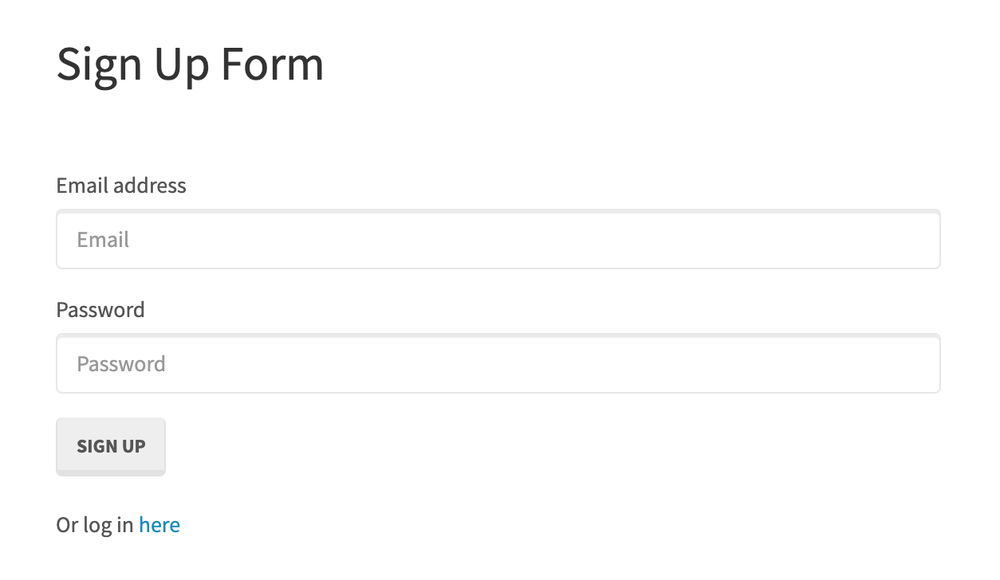

# reverseEngineering



# Purpose

The purpose of this page is to practice a login screen an analize what the code is doing and practice pseudocoding!

## Installation

``` 
npm install
```
This will install:
* bcryptjs, express, express-session, mysql2, passport, passport-local, sequelize

# server.js

This file requires express and express-session to be installed through npm install. It also requires passport.js and the models folder. 

The port is called and fisrt checks for either the environment variable PORT or will default to port 8080 as a local host:
```
var PORT = process.env.PORT || 8080;
```
Express uses urlencoded (library parsing), json(incoming JSON request parsing), static (service to static files), and session (tracking user login status). It also initializes passport and passport sessions.

Finally, sequelize sync is used to listen to the desired port and log the port information for the user.

```
db.sequelize.sync().then(function() {
  app.listen(PORT, function() {
    console.log("==> 🌎  Listening on port %s. Visit http://localhost:%s/ in your browser.", PORT, PORT);
  });
});
```

# Config

## Middleware: isAuthenticated

This file applies the middleware for restricing routs a user is not allowed to visit if not logged in. Which means if the username and password are not found insisde the database, then the user cannot observe the '/members' URL. 
```
module.exports = function(req, res, next) {
  if (req.user) {
    return next();
  }
  return res.redirect("/");
};
```

## convig.json

This connects the app to the database using your own personal server username and password. This will provide access to the database to add and read information.

## passport.js

This file requires [passport.js](https://www.passportjs.org) (used for authentication) with it's passport-local strategy to be installed before running. It also requires the models folder. 

# Routes

## api-routes

API routes navigates the api urls within the app. It uses app.post and app.get to either create or read information. When directed to the /api/login url the user's information is checked against the existing database to ensure they are a current user. The [passport authenticate](http://www.passportjs.org/docs/authenticate/) function ensures information is correct or will return a 401 unauthorized status to the user. When directed to the /api/signup url, it will refer to the models folder to create the user information. It takes in email and password as objects and redirect the information to the /api/login url. _(See section_ models _for error handling and information processing)_ When the user is inside the /members url they will be given an option to 'logout' which will return them to the root (/). The app uses /api/user_data to access if the user is already logged in.  

## html-routes

html-routes is where the app will send information to the HTML pages. From the root (/), if the user already has an account ti will automatically redirect them to their members page upon login; This will also occur from the /login url. When the app is accessing /members url it authenticates if the user is authorized to see the page (i.e. logged in)

# Models

## index.js

The index file inside of models requires an install of file server(fs), path, and sequelize. This verifies which database you want to use. 

The fs is used to read the directory and filter it based on files that do the file does not contain the basename, are not hidden files (containing a . at the beginning of the filename), and ensure they are a JavaScript file. Once they are filtered, each file will imported to sequelize db by joining the directory name with the file name. model.name is then created as a key inside of the object db and assigned to the name 'model'. The code below allows the app to load all files that are inside the db object so the creator does not need to keep calling every file located in the models folder.

```
Object.keys(db).forEach(function(modelName) {
  if (db[modelName].associate) {
    db[modelName].associate(db);
  }
});
```

## user.js

Bcryptjs installation is required inside this file. The user model is crated with sequelize. This sets the parameters for the database. The datatype for both the email and password is a STRING and cannot be null. The email has to be unique and is also validated that it is an email through a prewritten method with sequelize. 

```
    email: {
      type: DataTypes.STRING,
      allowNull: false,
      unique: true,
      validate: {
        isEmail: true
      }
    password: {
      type: DataTypes.STRING,
      allowNull: false
    }
```
The password validator creates a custom method for the User model. This will check if an unhashed password entered by the user can be compared to the hashed password stored in our database. The hashed password is made using bcryptjs. The password will be hashed before teh User is created.

# Public

** All of the HTML files use Bootstrap for styling. **

## js login.js / login.html

This form uses JQuery to target classes inside the html. The html imports the javascript inside a script tag:
```
  <script type="text/javascript" src="js/login.js"></script>
```
When submit is clicked, it accesses the user input data to post the data. The function 'loginUser' takes in two paramaters when posting information to the /api/login/ url. The post applies an email and password to the DB. It will then load the /members url. 

## js members.js / members.html

This document will take in user login information and add the user email to the html page using a get request.

## js signup.js / signup.html

Similar to the login.js, this form uses JQuery to target classes inside the html. When the submit is clicked, it acceses the user input data to post the data. When there is data for username and password, it will run the signUpUser function. The signup user function posts to the /api/signup url with the email and password and relocates the page to /members url. this adds data to the db for future logins. When there is a login err (i.e. improper username or password) then it will run the handleLoginErr function to produce a 500 response and an alert.

# Resources:

* https://www.passportjs.org
* https://expressjs.com/
* https://sequelize.org/
* https://www.npmjs.com/package/bcryptjs

# Author

Jennifer Henry

* LinkedIn
* GitHub
* jenhenry1995@gmail.com